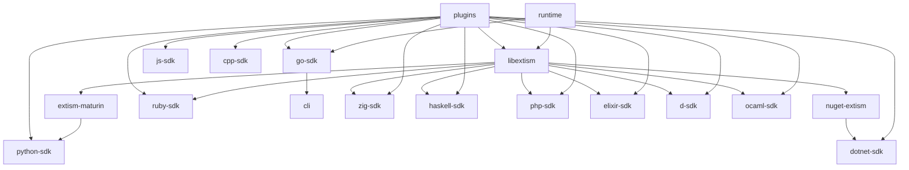

# HACKING 

## cutting releases

### goals

Cutting a release should be a boring, rote process with as little excitement as
possible. Following the processes in this document, we should be able to cut a
release at any time without worrying about producing bad artifacts. Our process
should let us resolve build issues without affecting library users.

### branching

1. The `main` branch represents the next major version of the library.
2. Previous major versions should be tracked using `v0.x`, `v1.x`, `v2.x`, used
   for backporting changes as necessary.
3. Libraries should generate a `latest` release using, e.g.,
   `marvinpinto/action-automatic-releases` on changes to the `main` branch.

### tag and release process

1. Pick a target semver value. Prepend the semver value with `v`: `v1.2.3`.
   Increment the minor version for additive changes and patch for bugfixes.
   - For trickier changes, consider using release candidates: `rc0`, `rc1`, etc.
2. Create an empty git commit for the tag to point at: `git commit -m 'v1.2.3-rc1' --allow-empty`.
3. Create a new tag against that commit: `v1.2.3-rc1`.
4. Push the changes to the library: `git push origin main v1.2.3-rc1`.
    - You can separate these steps: `git push origin main` followed by `git push origin v1.2.3-rc1`,
      if you want to make absolutely sure the commit you're pushing builds correctly before tagging it.
5. Wait for the tag `build` workflow to complete.
    - The `build` workflow should create a _draft_ release (using `softprops/action-gh-release` with `draft`
      set to `true`) and upload built artifacts to the release.
6. Once the workflow is complete, do whatever testing is necessary using the artifacts.
    - TODO: We can add automation to this step so that we test on downstream deps automatically: e.g., if we
      build a new kernel, we _should_ be able to trigger tests in the `python-sdk` _using_ that new kernel.
7. Once we're confident the release is good, go to the releases page for the library and edit the draft release.
    - If the release is a release candidate (`rc0..N`), make sure to mark the release as a "prerelease".
    - Publish the draft release.
    - This kicks off the publication workflow: taking the artifacts built during the `build` workflow and publishing
      them to any necessary registry or repository.
        - In extism, this publishes `extism-maturin` to PyPI as `extism-sys` and the dotnet packages to nuget.
        - In `python-sdk`, this publishes `extism` to PyPI.
        - In `js-sdk`, this publishes `@extism/extism` (and `extism`) to NPM.

> **Note**
> If you're at all worried about a release, use a private fork of the target library repo to test the release first (e.g., `extism/dev-extism`.)

#### CLI flow

For official releases:

```
$ git commit -m 'v9.9.9' --allow-empty
$ git tag v9.9.9
$ git push origin main v9.9.9
$ gh run watch
$ gh release edit v9.9.9 --tag v9.9.9 --title 'v9.9.9' --draft=false
$ gh run watch
```

For prereleases:

```
$ git commit -m 'v9.9.9' --allow-empty
$ git tag v9.9.9
$ git push origin main v9.9.9
$ gh run watch
$ gh release edit v9.9.9 --tag v9.9.9 --title 'v9.9.9' --draft=false --prerelease
$ gh run watch
```

### implementation

Libraries should:

- Provide a `ci` workflow, triggered on PR and `workflow_dispatch`.
    - This workflow should exercise the tests, linting, and documentation generation of the library.
- Provide a `build` workflow, triggered on `v*` tags and merges to `main`
    - This workflow should produce artifacts and attach them to a draft release (if operating on a tag) or a `latest` release (if operating on `main`.)
    - Artifacts include: source tarballs, checksums, shared objects, and documentation.
- Provide a `release` workflow, triggered on github releases:
    - This workflow should expect artifacts from the draft release to be available.
    - Artifacts from the release should be published to their final destination as part of this workflow: tarballs to NPM, documentation to Cloudflare R2/Amazon S3/$yourFavoriteBucket.

### A rough list of libraries and downstreams



